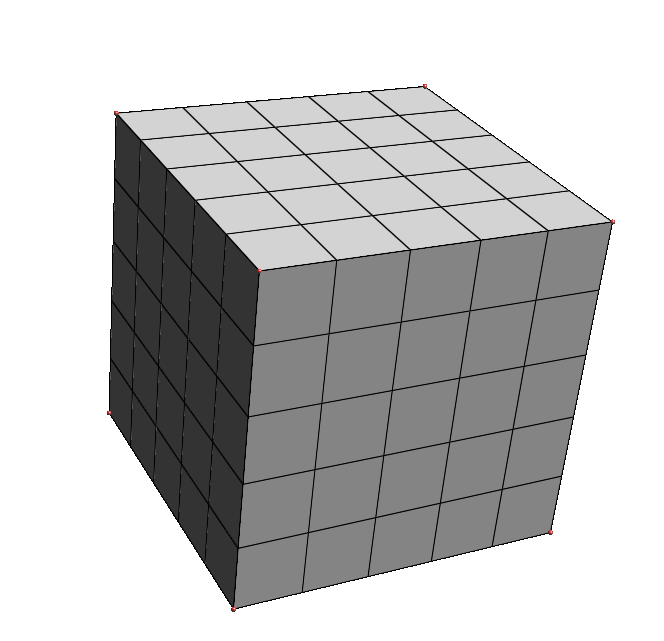

# UnitCube

Executable to build a unit cube, meshed with hexaedrons

## Dependencies
 * [RINGMesh](https://github.com/ringmesh/RINGMesh)

## Setup

### Linux
```
mkdir build
cd build
cmake .. -DRINGMesh_INSTALL_PREFIX:STRING=path_to_RINGMesh
cd Release   (or Debug)
make
```
It will make an executable named unit_cube.
### Windows (in progress)

## Usage

```
./unit_cube nb_hex=5 out:geomodel=unit_cube_5.gm
```

 * nb_hex = the number of hex in one direction (here you will have the unit cube meshed with 5x5x5 hexs). The mesh size will be computed by UnitCube (here 1./5 = 0.2)
 * out:geomodel path to the outputed geomodel

##  Result
[](images/cube5x5.png)
